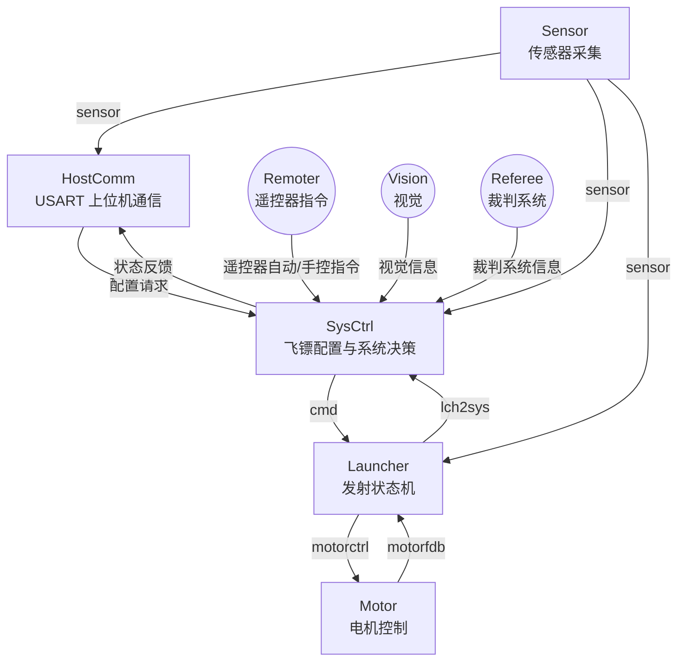

# 文档阅读指引

**学习与调试路径**

**经验之谈**

**调试留档**

---

# 写在前面

相对于其他机器人来说，飞镖是一个非常独立且特殊的兵种。它拥有着相对来说最稳定的工况，最固定的流程和完全自动的逻辑。

同时，由于兵种相对独立，镖架代码可能很难从同队伍的其他兵种处得到直接的参考，尤其包括一些特殊的元器件与电机，较为复杂机电系统的稳定协同。

# 0. 写在前面
相对于其他机器人来说，飞镖是一个非常独立且特殊的兵种。它拥有着相对来说最稳定的工况，最固定的流程和完全自动的逻辑。我们可以说，镖架电控对控制方面的要求并不算很高。
但正因为稳定的工况和全自动发射的需求，镖架需要稳定、时序严格的状态机，以及尽可能多的，面对各种可能发生的突发情况的冗余处理（详见26UC的惨案）
同时，由于兵种相对独立（没有轮子且全自动），镖架代码可能很难从同队伍的其他兵种处得到直接的参考。
且飞镖可能会接触一些其他兵种完全不用的电机和电子元器件，机电系统较为复杂
所以完成“在赛场上足够稳定“的镖架代码并不容易。

# 1. 作为一个镖架电控，需要掌握什么
## 1. 基本电控技术栈
## 2. 与硬件：
1. 能够阅读简单的原理图，阅读pcb的走线
2. 基本的硬件debug能力。例如检查是否短路断路，线序是否有误
3. 
## 3. 与机械：
飞镖是一个非常看重机械的兵种。所以对于很多机械问题，大胆质疑，小心求证。
1. 至少需要对“需要进行控制的部分“有基本的认识和理解，非常有利于和机械共同debug和改进

# 2. 除了写代码、debug和测试，镖架电控还需要干什么
1. 

# 