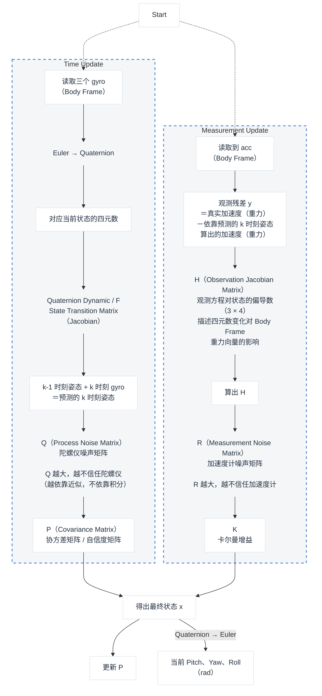

```mermaid
flowchart TB

    Start["Start"]

    subgraph KF[" "]
        direction LR

        %% ==================== Time Update ====================
        subgraph TimeUpdate["Time Update"]
            direction TB

            Gyro["读取三个 gyro<br/>（Body Frame）"]

            EulerToQuat["Euler → Quaternion"]

            CurrentQuat["对应当前状态的四元数"]

            F["Quaternion Dynamic / F<br/>State Transition Matrix（Jacobian）"]

            PredictedState["k-1 时刻姿态 + k 时刻 gyro<br/>＝预测的 k 时刻姿态"]

            Q["Q（Process Noise Matrix）<br/>陀螺仪噪声矩阵<br/><br/>Q 越大，越不信任陀螺仪<br/>（越依靠近似，不依靠积分）"]

            P["P（Covariance Matrix）<br/>协方差矩阵 / 自信度矩阵"]

            Gyro --> EulerToQuat
            EulerToQuat --> CurrentQuat
            CurrentQuat --> F
            F --> PredictedState
            PredictedState --> Q
            Q --> P
        end

        %% ================= Measurement Update =================
        subgraph MeasurementUpdate["Measurement Update"]
            direction TB

            Acc["读取到 acc<br/>（Body Frame）"]

            Residual["观测残差 y<br/>＝真实加速度（重力）<br/>－依靠预测的 k 时刻姿态<br/>算出的加速度（重力）"]

            HInfo["H（Observation Jacobian Matrix）<br/>观测方程对状态的偏导数（3 × 4）<br/>描述四元数变化对 Body Frame<br/>重力向量的影响"]

            CalculateH["算出 H"]

            R["R（Measurement Noise Matrix）<br/>加速度计噪声矩阵<br/><br/>R 越大，越不信任加速度计"]

            K["K<br/>卡尔曼增益"]

            Acc --> Residual
            Residual --> HInfo
            HInfo --> CalculateH
            CalculateH --> R
            R --> K
        end
    end

    Start -.-> Gyro
    Start -.-> Acc

    P --> FinalState["得出最终状态 x"]
    K --> FinalState

    FinalState --> UpdateP["更新 P"]

    FinalState -->|"Quaternion → Euler"| EulerOutput["当前 Pitch、Yaw、Roll<br/>（rad）"]

    %% ==================== Style ====================
    style KF fill:transparent,stroke:transparent

    style TimeUpdate fill:#f4f6f8,stroke:#4f86d9,stroke-width:2px,stroke-dasharray:6 6
    style MeasurementUpdate fill:#f4f6f8,stroke:#4f86d9,stroke-width:2px,stroke-dasharray:6 6

    classDef process fill:#ffffff,stroke:#e0e4e8,stroke-width:1px,color:#273444
    classDef description fill:transparent,stroke:transparent,color:#273444

    class Start,Gyro,CurrentQuat,PredictedState,P,Acc,Residual,CalculateH,K,FinalState,UpdateP,EulerOutput process
    class EulerToQuat,F,Q,HInfo,R description
```

    