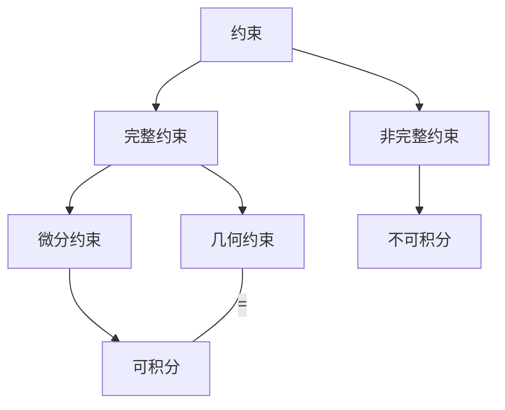

# 分析物理

## 约束与自由度

### 约束分类

### 自由度

- 自由度：可**独立变化**的物理量个数
	- 3n（n 为质点个数） - 完整约束的个数 - 不可积的微分约束

常用 $q_1, q_2 ... q_s$ 来表示广义坐标（$s$ 为广义坐标的个数，3n - 完整约束的个数）

## 基本形式的虚功原理

### 虚位移

1. 实位移
	$t + dt$ 时刻：{ ${}\vec{r_i}+\vec{d}r_i$}
2. 虚位移
	约束允许的位移 $\delta {\vec{r_i}}$
- 在**稳定约束** $\frac{\partial f}{\partial t} = 0$ 的情况下，实位移是虚位移中的一个

### 理想约束

#### 虚功

$$
\delta W = \sum_{i=1}^n (\vec{F_i} + \vec{R_i}) \cdot \vec{\delta}r_i = 0
$$

其中 $\vec{F_i}$ 为外力，$\vec{R_i}$ 为约束力

#### 广义力

$$
\delta W = \sum_{j=1}^s Q_j \delta q_j
$$

其中 $Q_j$ 为与广义坐标 $q_j$ 对应的广义力。若 $\vec{F_i}$ 为作用在第 $i$ 个质点上的主动力，则

$$
Q_j = \sum_{i=1}^n \vec{F_i} \cdot \frac{\partial \vec{r_i}}{\partial q_j}
$$

其中 $\frac{\partial \vec{r_i}}{\partial q_j}$ 表示广义坐标 $q_j$ 单位变化时，第 $i$ 个质点实际位置 $\vec{r_i}$ 的变化方向和大小。

#### 理想约束

$$
\sum_{i=1}^n \vec{R_i} \cdot \delta \vec{r_i} = 0 
$$

- 只受理想约束的系统——理想系统

## 拉格朗日方程

$$
L = T - V
$$

- 其中（粗略地理解）

$$
T \text{ 为动能} \quad \quad V \text{ 为势能}
$$

$$
\frac{d}{dt}\left( \frac{ \partial L }{ \partial \dot{x_i} }  \right) = \frac{ \partial L }{ \partial x_i } 
$$

## Related

- [[SelfStudy/Control_and_Robotics/Control and Robotics]]
- [[SelfStudy/Control_and_Robotics/Lagrangian Mechanics]]
- [[RM/balancedCar/Notes/WBR Modeling/singleleg_Lagrangian]]
