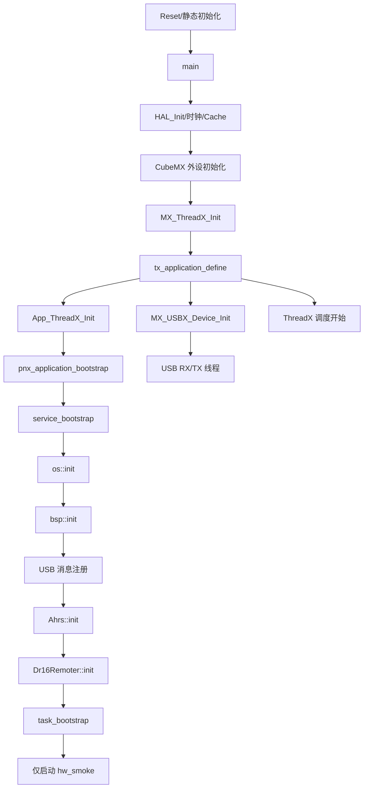
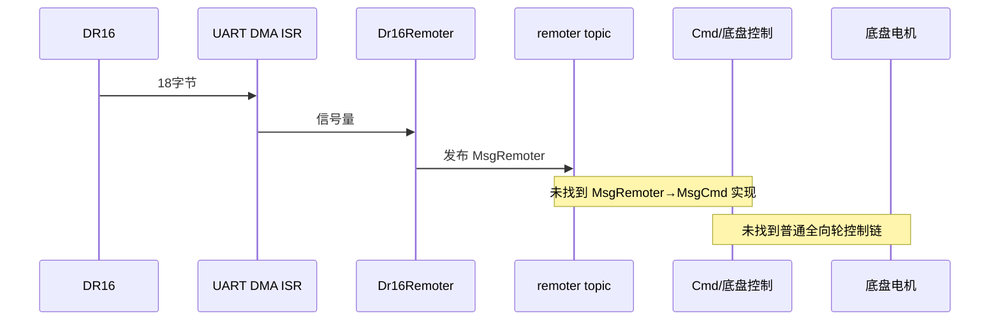
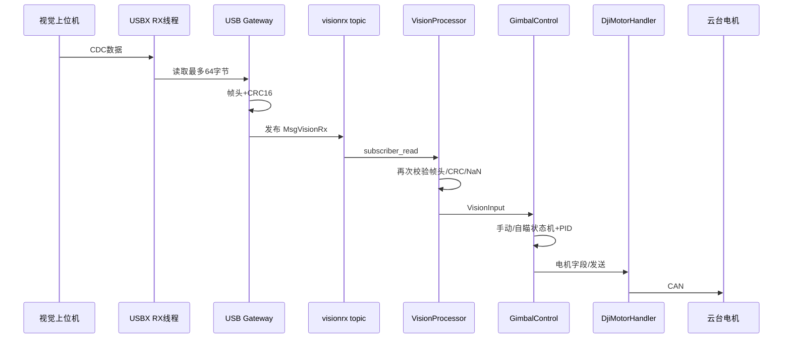

腿
小陀螺


队会：确定研究项目，研发方向，人员分配

周末调一下并腿，尽量在国庆调到去年的水平

- 考虑一下MPC和RL

- 云台

新架构


# 云台
1. 自瞄上限
	1. 如何量化 
		1. 0.02的误差
	2. 每个部分/每个阶段应该打到怎么样的误差
2. 换控制器


# 架构

1. 要修
	1. 怎么修？
	2. 安排人去修
2. 量化每个模块的性能
	1. 参考xrobot [串口收发性能测试 | XRobot Docs](https://xrobot-org.github.io/docs/perf/perf-uart)
3. 讨论需不需要实际部署 eg 小步
	1. 部署完之后再优化


# 定流程
- 需要经常研讨讨论
- 研发周期
- 分紧急程度

# 补充文档

1. 补充内容
2. 把去年的遗留东西归档
3. 调车经验
4. 整理基础数学/物理/计算机基础的资源视频/文档
---
### 1.  知识库使用说明
   - 知识库地图
   - 阅读与搜索方式
### 2.  学习路径
   - 学习路线
	   - 如果车组有比较独特的可以分车组
   - 阶段任务
   - 培训安排
### 3. wiki
   - 嵌入式系统+
     - STM32
     - 内存与 Cache
     - 中断与 DMA
     - 实时系统基础
   - 外设与通信
     - GPIO
     - UART
     - CAN
     - PWM 与定时器
     - SPI 与 I2C
     - USB
     - EtherCAT
   - 电机
   - 传感器
   - 控制理论
   - 状态估计与滤波
   - 运动学与解算
   - 动力学与建模
   - 裁判系统
### 4.  工程实践
   - 环境与工具链
   - 控制板初始化
   - 调试方法
   - 联调
### 5. Q&A 问题速查
   - 电机问题
   - CAN 问题
   - USB 与串口问题
   - IMU 问题
   - 供电与布线问题
   - 实车故障复盘
### 6.  代码架构与开发规范
   - Git
### 7. 开发流程模板
1. 开发调试模板
	1. 调试记录模板
	2. 验收标准
   - 开源调研模板
   - 故障记录模板
   - 上场检查模板
### 8. RM27
1. 研发
   - 新代码架构
	   - 新云台控制器
	   - 控制器定量评测
	   - MPC
	   - 其他研究专题
1. 车组调试记录
		- 分车组
### 9. 赛季与项目归档
- RM26

# 电控物资管理

1. 收拾东西！！！
2. 贵重物资如何管理


# 研究方向

1. threadx线程

2. 嵌入式：内存？性能优化？去年没做完的
	1. 架构
## 新架构review文档
### 1. 审查范围与未覆盖内容

本次为严格只读审查，未修改文件、未生成 commit、未运行会写入构建目录的配置或构建命令。工作树为 clean。

实际阅读范围：

- 启动与平台：`Core/`、`AZURE_RTOS/`、`USBX/`
- 构建与配置：根 `CMakeLists.txt`、各 `pnx_*` CMake、`pnx_configs/`
- 全部产品层：`pnx_os`、`pnx_bsp`、`pnx_devices`、`pnx_modules`、`pnx_application`、`pnx_tasks`
- 重点追踪：ThreadX、消息总线、CAN、UART/DMA、USB、DJI/DM 电机、IMU/AHRS、遥控器、视觉、云台、轮腿、裁判系统
- 搜索了动态分配、全局变量、packed、volatile、CRC、超时、掉线、看门狗、NaN/Inf、测试入口等。

未逐行审查：

- STM32 HAL、CMSIS、ThreadX、USBX 第三方内部实现
- `pnx_modules/ui` 的全部绘图细节
- EKF、VMC、LQR 数学正确性及参数稳定性
- 硬件时序、栈峰值、WCET、CAN 总线负载

这些项目需要目标板测量或算法专项审查，不能仅凭静态代码下确定结论。

---

### 2. 工作区架构地图

## 2.1 当前目录和构建目标

```
pnx_embedded
├─ Core / Drivers / Middlewares / USBX / AZURE_RTOS
│  └─ CubeMX、HAL、ThreadX、USBX 和启动代码
├─ cmake
│  └─ 工具链、平台库、CubeMX target
├─ pnx_configs
│  └─ 板级开关、电机布局、OS 配置
├─ pnx_os
│  └─ ThreadX 封装和 OneMessage 总线
├─ pnx_libraries
│  └─ PID、滤波、矩阵、CRC、数学工具
├─ pnx_bsp
│  └─ CAN/UART/SPI/PWM/ADC/DWT 等板级封装
├─ pnx_devices
│  └─ DJI/DM/LK 电机、BMI088、LED
├─ pnx_modules
│  └─ AHRS、遥控器、裁判系统、USB 网关、UI、消息定义
├─ pnx_application
│  └─ 云台、视觉处理、轮腿控制算法
└─ pnx_tasks
   └─ 对象装配、服务初始化、线程创建
```

根构建生成：

- `pnx_embedded`：完整固件
- `pnx_libs`：产品静态库集合
- `pnx_os` → `pnx_libraries` → `pnx_bsp` → `pnx_devices` → `pnx_modules` → `pnx_application` → `pnx_tasks`

证据见 [CMakeLists.txt (line 28)](D:/01_Workspace/RM/PnX_embedded/CMakeLists.txt:28)。

当前并非真正的 submodule 集成：Git 中没有 `160000` gitlink，也没有生效的 `.gitmodules`，只有 `.gitmodules.example`。这与仓库特殊规则第 7 条目标不一致，但 README 明确说明当前仍处于 monorepo 阶段。

## 2.2 各层实际职责和越界

| 层                 | 实际职责                     | 主要依赖/越界                                        |
| ----------------- | ------------------------ | ---------------------------------------------- |
| `pnx_os`          | 隐藏 ThreadX、提供线程/信号量/消息话题 | 内部动态池分配；消息互斥锁无优先级继承                            |
| `pnx_bsp`         | 隐藏 CAN/UART/PWM HAL 句柄   | 总体边界清楚；CAN/UART 错误传播不完整                        |
| `pnx_devices`     | 电机、IMU 等具体设备             | `Bmi088` 直接操作 HAL/SPI/GPIO，绕过已有 BSP SPI        |
| `pnx_modules`     | AHRS、遥控、裁判、USB 服务        | USB 网关直接依赖 ThreadX、USBX、OneMessage，绕过 `pnx_os` |
| `pnx_application` | 控制和算法                    | 云台直接依赖 `DjiMotorHandler` 及具体电机 public 字段       |
| `pnx_tasks`       | 装配、线程和生命周期               | 适合作为 composition root，但错误返回普遍被忽略               |

## 2.3 当前真实启动链





关键证据：

- MCU/外设初始化：[main.c (line 74)](D:/01_Workspace/RM/PnX_embedded/Core/Src/main.c:74)
- ThreadX 入口：[app_threadx.c (line 63)](D:/01_Workspace/RM/PnX_embedded/Core/Src/app_threadx.c:63)
- 服务顺序：[service_bootstrap.cpp (line 14)](D:/01_Workspace/RM/PnX_embedded/pnx_tasks/src/service_bootstrap.cpp:14)
- 当前只启动冒烟任务：[task_bootstrap.cpp (line 5)](D:/01_Workspace/RM/PnX_embedded/pnx_tasks/src/task_bootstrap.cpp:5)

## 2.4 生命周期和所有权

- AHRS、遥控器、电机 Handler：函数内静态单例，构造后不析构。
- 控制任务中的电机、控制器、线程栈：匿名 namespace 全局对象，生命周期覆盖整个固件。
- Handler 以裸指针引用全局电机；当前对象不会析构，因此没有实际悬空，但接口没有表达这一约束。
- Topic/Subscriber wrapper 从 4096 字节池分配，没有释放流程。
- 未发现 `unique_ptr`、`shared_ptr`；当前长期对象模型不需要它们。
- 初始化结果没有向上传播：`os::init()`、`Ahrs::init()`、`Dr16Remoter::init()` 的返回值均被忽略。
- 若启用轮腿任务，`g_app` 内的 `Odometry` 会在静态构造期创建 `KalmanFilter`，而其内存依赖尚未初始化的 OS 字节池。这会形成启动前空指针风险，证据见 [wheel_legged_task.cpp (line 26)](D:/01_Workspace/RM/PnX_embedded/pnx_tasks/wheel_legged/src/wheel_legged_task.cpp:26)、[kalman_filter.cpp (line 7)](D:/01_Workspace/RM/PnX_embedded/pnx_libraries/filter/src/kalman_filter.cpp:7)。

---

### 3. 核心调用链报告

#### 3.1 当前实际执行链

当前固件不是完整机器人控制固件，而是 bring-up 固件：

```
启动
→ AHRS 与 DR16 服务初始化
→ hw_smoke 线程
→ 固定设置 GM6020 speed_set = 3 rad/s
→ 每 1 ms 调用 DjiMotorHandler::send_control_data()
→ CAN 发出电流命令
```

冒烟任务没有使用 `remoter.offline` 或开关状态门控电机。证据：

- 固定速度、模式和电流上限：[test.cpp (line 68)](D:/01_Workspace/RM/PnX_embedded/pnx_tasks/src/test.cpp:68)
- 周期发送：[test.cpp (line 101)](D:/01_Workspace/RM/PnX_embedded/pnx_tasks/src/test.cpp:101)

如果电机实际连接，这是明确的 P0 风险。

### 3.2 遥控器到底盘电机

完整链路：**未找到实现**。

已存在：

```
UART5 DMA
→ HAL_UARTEx_RxEventCallback
→ Dr16Remoter::rx_callback
→ Dr16Remoter::thread_loop
→ MsgRemoter / "remoter" topic
```

缺失：

- `MsgRemoter` → 操作意图/模式 → `MsgCmd` 的生产者
- 普通全向轮 `vx/vy/wz`
- 坐标转换
- 全向轮/麦轮运动学
- 底盘功率限制

搜索只发现 `MsgCmd` 的消费者和兜底创建，没有任何发布者。

````

````

### 3.3 CAN 电机反馈到闭环

```
FDCAN IRQ
→ HAL_FDCAN_RxFifo0/1Callback
→ bsp::can_detail::on_rx
→ dispatch_rx
→ DjiMotorHandler/DmMotorHandler::on_can_rx
→ motor->on_can_rx
→ Feedback public 状态
→ 控制线程读取
→ PID/算法
→ Handler::send_control_data
→ bsp::can_transmit
```

优点：帧解析和单位转换集中在设备层，DJI RPM/编码器被转换为 rad/s 和 rad。

风险：

- ISR 写 `Feedback`，线程无同步读取，属于 C++ 数据竞争。
- CAN callback 对每帧遍历最多 8 个回调，WCET 有界但随注册数增长。
- `bsp::can_transmit()` 不检查 HAL 返回值，却返回 `Status::Ok`，见 [bsp_can.cpp (line 157)](D:/01_Workspace/RM/PnX_embedded/pnx_bsp/can/src/bsp_can.cpp:157) 和 [can_classical.cpp (line 63)](D:/01_Workspace/RM/PnX_embedded/pnx_bsp/can/src/can_classical.cpp:63)。
- 在线判断只是“自上次调用后计数是否变化”，不是时间戳；调用周期变化会改变掉线语义。

### 3.4 视觉到云台电机




该链目前被注释，不运行。

确认的问题：

- `VisionProcessor` 只拒绝 NaN，不拒绝 Inf：[vision_processor.cpp (line 18)](D:/01_Workspace/RM/PnX_embedded/pnx_application/vision/src/vision_processor.cpp:18)。
- subscriber 没有新数据时，任务忽略返回值并继续使用旧 `vision_rx`，旧目标可无限生效。
- 没有视觉时间戳、序号或超时。
- USB 只按一次 64 字节读取匹配一个固定结构；未找到跨读取重组、粘包拆分或重同步。
- pitch 环写入 `current_set` 后立即把模式设为 `Relax`；随后 `DjiMotor::set_output()` 会归零电流。因此 pitch 输出实际被抵消，见 [gimbal_control.hpp (line 95)](D:/01_Workspace/RM/PnX_embedded/pnx_application/gimbal/include/gimbal_control.hpp:95)。
- yaw 只形成 `MsgMotor::yaw_current`；未找到该消息的消费者或板间发送实现。

### 3.5 轮腿控制链

轮腿任务存在但未启动。其输出还有两处模式不匹配：

- `WheelLegged::torque_control()` 把 DM 关节设为 `ActuatorMode::Torque`，但 `Dm8009p::set_output()` 不处理 `Torque`，落入 default 并发送失能帧。
- 轮电机写入 `current_set` 后将模式设为 `Relax`，DJI Handler 会把电流归零。

证据见 [wheel_legged.hpp (line 157)](D:/01_Workspace/RM/PnX_embedded/pnx_application/wheel_legged/include/wheel_legged.hpp:157) 和 [dm8009p.cpp (line 32)](D:/01_Workspace/RM/PnX_embedded/pnx_devices/motors/dmmotors/src/dm8009p.cpp:32)。

结论：轮腿算法结构存在，但当前执行器输出链不闭合。

### 3.6 云台—底盘通信

**未找到实现。**

`BoardLinkStatus`、`MsgMotor`、`MsgChassisUi` 只是类型；未找到编码、发送、接收、版本、sequence、heartbeat、timeout 或命令仲裁。

### 3.7 裁判系统到功率限制

裁判 UART/DMA、环形缓冲、CRC 和解析器存在，但：

- `Referee::init()` 没有在 bootstrap 中调用。
- 普通底盘功率限制器未找到。
- 云台热量限制只读取 `GimbalInput.board`，但任务未给该字段赋值。
- 解析数据结构是循环体局部变量；没有新帧时下一周期会被零值覆盖。
- heartbeat 每 1 ms 无条件释放，与是否收到合法裁判帧无关。

因此这条链目前没有闭合。

---

### 4. 数据流与状态所有权报告

|数据|产生/校验|最新值所有者|失效策略与问题|
|---|---|---|---|
|遥控/键鼠|DR16 UART；无帧合法范围校验|`Dr16Remoter` 局部 `MsgRemoter` + topic|有 timeout/offline，但旧轴值未清零；没有安全层强制消费 offline|
|`MsgCmd`|未找到生产者|无法确认|控制任务只读默认零值|
|视觉目标|USB Gateway + VisionProcessor 双 CRC|topic 缓冲和任务局部副本|无时间戳；旧合法目标会持续使用；Inf 可通过|
|IMU/AHRS|BMI088 + EKF|`Ahrs`/topic|heartbeat 是累计信号量，不表示 freshness|
|电机反馈|CAN ISR|电机 public `feedback`|ISR/线程无同步；在线状态无时间戳|
|裁判数据|UART ISR + parser|`Referee` 循环局部/MsgReferee|数据不能稳定保持；heartbeat 不代表有效帧|
|超级电容|未找到实现|—|—|
|云台状态|GimbalControl 内部|私有状态 + MsgMotor 部分输出|yaw 板间消费者未找到|
|底盘状态|仅轮腿 `MsgWheelLegged`|轮腿任务|普通全向轮状态未找到|
|发射机构|云台控制内摩擦轮 + trigger_speed|多处 public 电机字段/MsgMotor|trigger 执行器未找到|
|最终命令|Handler 打包并发送|电机 public setpoint|任意上层持有指针即可改写；没有统一来源标记|
|故障状态|电机 state、IMU self_test 等零散字段|各设备对象|没有统一 FaultManager 或系统级覆盖|
|时间戳/freshness|仅底层消息引擎内部可选时间字段|未暴露给业务|关键消息均未携带 freshness|

单位方面，AHRS 和 DJI 电机已有 rad、rad/s 注释或转换，这是值得保留的设计。但单位仍未由类型系统约束，`float` 可被误接。

---

### 5. 中断、回调、任务和同步报告

ThreadX tick 为 1000 Hz，因此 `thread_sleep(1)` 为约 1 ms。

|上下文|内容/数据|同步|阻塞、分配与风险|
|---|---|---|---|
|FDCAN ISR|取帧、遍历 callback、直接更新电机反馈|无|不阻塞、不分配；ISR/线程数据竞争|
|UART DMA/Idle ISR|cache invalidate、信号量/callback、立即重启 DMA|信号量|DMA 缓冲重新交给 DMA 后线程才读取，所有权不清|
|裁判 UART callback|ISR 内逐字节写环形缓冲|`volatile` head/tail|无满检测；覆盖和 head==tail 歧义|
|USB OTG ISR|USBX 驱动|USBX 内部|业务在 USB 线程处理|
|TIM23 ISR|HAL tick|HAL 全局 tick|固定、短|
|AHRS IMU task，优先级3|SPI 阻塞读取、EKF、publish|topic mutex|1 ms 周期；SPI HAL timeout 1000 ms|
|AHRS temp task，优先级4|同一 BMI088/SPI、温度控制|无|与 IMU task 共享 SPI/对象，无 mutex|
|DR16 task，优先级2|解析并发布|semaphore/topic mutex|100 ms timeout|
|USB RX task，优先级5|阻塞 USB read、CRC、publish|USBX/topic mutex|粘包/拆包不完整|
|可选云台 task，优先级1|控制和 CAN 发送|topic mutex|高优先级可能等待低优先级 topic owner|
|可选轮腿 task，优先级5|大型状态机、LQR/VMC、CAN|topic mutex|WCET 未测|
|当前 smoke task，优先级8|UART 阻塞打印、CAN、电机控制|无|`HAL_UART_Transmit` 最长等待100 ms|
|裸机主循环|无实际业务|—|调度开始后不可达|

消息总线的默认 `publish` 会无限等待 mutex，而 mutex 使用 `TX_NO_INHERIT`，证据见 [os.hpp (line 23)](D:/01_Workspace/RM/PnX_embedded/pnx_os/include/os.hpp:23)、[os_rtos_threadx.cpp (line 176)](D:/01_Workspace/RM/PnX_embedded/pnx_os/src/os_rtos_threadx.cpp:176)。这会形成优先级反转风险。

---

### 6. 封装与依赖报告

#### 6.1 做得好的部分

1. HAL 句柄总体被限制在 BSP，CAN/UART 上层接口使用 `enum class` 和平台无关回调。
2. 电机协议解析与单位换算集中在具体设备类。
3. `pnx_tasks` 明确承担装配职责，算法层原则上不创建线程。
4. 消息话题使生产者与消费者不必直接持有彼此对象。
5. 线程栈、电机对象和主要缓冲区大多静态准备，没有在热循环中使用 `new/delete`。

#### 6.2 封装不足

- `Actuator` 的 feedback、模式、全部 setpoint、PID 和设备原始状态大量 public；任何模块都能绕过仲裁直接改命令，见 [motor.hpp (line 50)](D:/01_Workspace/RM/PnX_embedded/pnx_devices/motors/include/motor.hpp:50)。
- 云台应用直接依赖 `DjiMotorHandler`，并修改具体电机 PID public 字段，不是纯算法接口。
- `Bmi088` 直接使用 `hspi2`、GPIO 和 TIM HAL，跨过 BSP。
- USB 模块直接使用 `tx_api.h`、`om.h`、USBX，平台隔离不完整。
- 模式、安全、执行器写入权没有唯一出口。
- 正确使用依赖隐式顺序：必须先注册电机、再 bind、再 update；bind 不检查空指针。

#### 6.3 可能的过度封装

没有发现 Interface→Adapter→Manager→Service 的长链或工厂/反射系统。整体不是“抽象层过深”。

存在两类偶然复杂度：

- `Actuator` 已使用运行期虚函数，同时上层又用模板固定具体电机类型，形成双重多态。模板确实解决编译期电机常数和零运行期开销问题，但仍依赖具体 public 字段，替换收益低于表面程度。
- `if constexpr (devices::is_actuator_v<HipType>)` 在类级 `static_assert` 已保证同一条件后基本恒真，增加阅读负担而没有额外语义。

#### 6.4 C++ 使用评价

- 恰当：namespace、`enum class`、composition、constexpr、静态栈、函数内单例。
- 部分过度：轮腿 659 行模板实现让错误集中到头文件，编译错误和调试成本较高。
- 运行期配置被部分固化为模板类型，但具体总线、ID 仍在配置层，尚可接受。
- 未发现异常、RTTI、`shared_ptr`、`std::function` 热路径滥用。
- RAII 较弱：线程、信号量、Topic 都靠显式初始化，没有自动清理或有效性对象。
- `volatile` 被用于调试变量和环形缓冲，但不能替代 ISR/线程同步。
- packed wire struct 直接作为协议，依赖编译器位域布局和小端 MCU；协议兼容性脆弱。
- `matrix::mat_init()` 使用 `malloc` 且没有失败检查/释放；是否进入热路径未找到证据。
- `KalmanFilter` 从字节池连续分配且立即 `memset`，没有检查任何分配失败。

---

### 7. 完整步兵功能覆盖矩阵

|功能|状态|说明|
|---|---|---|
|遥控器|有框架但不完整|DR16 解析/掉线标志存在，无范围校验和命令转换|
|键鼠|有框架但不完整|字段解析存在|
|云台|有框架但不完整|任务关闭，pitch 输出被 Relax 抵消，yaw 执行链缺失|
|普通全向轮底盘|未发现|当前是轮腿控制|
|轮腿底盘|有框架但不完整|算法较完整，执行器模式不匹配|
|发射机构|有框架但不完整|摩擦轮和 trigger_speed，缺少拨弹执行端|
|电机|有框架但不完整|DJI/DM/LK 支持；错误和发送失败处理不足|
|IMU|有框架但不完整|BMI088/AHRS 已运行，自检失效逻辑有缺陷|
|视觉|有框架但不完整|USB/CRC/处理存在，无 freshness|
|裁判系统|有框架但不完整|未初始化，状态缓存逻辑错误|
|超级电容|未发现|架构可新增 module/device|
|板间通信|未发现|仅有消息类型|
|模式管理|有框架但不完整|云台/轮腿局部状态机，无系统级仲裁|
|功率限制|未发现||
|热量限制|有框架但不完整|云台逻辑存在，数据未接入|
|离线检测|有框架但不完整|遥控/电机/AHRS 信号量，语义不统一|
|故障降级|有框架但不完整|局部 relax，无统一安全覆盖|
|日志|有框架但不完整|冒烟 UART、OneMessage 日志；无故障日志|
|参数管理|有框架但不完整|constexpr/配置头，无版本或持久化|
|在线调参|未发现||
|调试接口|有框架但不完整|冒烟任务和 volatile 调试量|
|看门狗|未发现|HAL IWDG/WWDG 均未启用|
|紧急失能|有框架但不完整|电机 relax/disable API 存在，无系统入口|
|仿真/单元测试|未发现|`test.cpp` 是硬件冒烟，不是自动化测试|

---

### 8. 架构评分表

|维度|分数|依据与边界|
|---|---|---|
|目录和分层|4|目录语义清楚；USB、BMI088 有跨层|
|文件/函数易读性|3|多数直接；轮腿 659 行、UI 超大|
|命名一致性|3|namespace/类型较一致；旧命名、TODO、乱码注释较多|
|职责单一性|3|层级总体明确；电机对象同时含协议、PID、命令和健康|
|封装合理性|2|public 执行器状态和 setpoint 过多|
|模块耦合|2|application 依赖具体设备字段和 Handler|
|掉包能力|2|有类型模板和设备层，但替换仍跨任务/配置/控制|
|数据所有权|2|topic 有缓冲，但 freshness、单写者、ISR边界不清|
|调度可理解性|3|任务入口集中；真实启用状态与框架能力差距大|
|ISR/线程边界|2|callback 清晰，但共享状态无同步、DMA所有权不清|
|实时确定性|2|静态线程较好；阻塞 mutex/SPI/UART、无 WCET|
|内存确定性|2|固定池和静态栈是优点；分配失败会空指针访问|
|错误处理|1|初始化、CAN TX、USB TX 等错误大量被忽略|
|失联与降级|1|freshness 不成立，旧命令可继续生效|
|配置/实现分离|3|motor layout/board config 已分离，算法参数仍散落|
|平台隔离|3|BSP 主体较好；BMI088、USB、smoke 绕过|
|测试能力|1|未发现单元/仿真测试|
|调试和可观测性|2|有 smoke 输出；无结构化故障和命令来源|
|兵种复用能力|2|分层基础存在；消息与任务仍高度产品化|
|新成员接手成本|2|目录易懂，但当前运行链、禁用链和隐式约定混杂|

总体评分：**2/5**，不是简单平均。

最影响工程质量的三个因素：

1. 安全与 freshness 链未闭合；
2. 多条控制链代码存在，但执行器输出语义不一致，无法证明可工作；
3. 错误返回被吞掉，系统可能“看起来运行”但没有真实完成 I/O。

---

### 9. 掉包能力测试

|场景|难度|预计范围|主要阻碍|已有隔离点|
|---|---|---|---|---|
|A 替换底盘电机|高|约 4～8 个 MCU 文件；driver、handler、layout、task、模板实例、控制器|控制器访问 public 字段；Handler 按品牌分裂；模式语义不统一|`Feedback` 有统一单位，电机配置集中|
|B 替换视觉 USB/协议|中高|gateway、消息结构、注册表、processor，约 3～5 文件；上位机范围无法确认|wire struct 与业务消息同型；无流式 parser/freshness|视觉业务处理已独立于 USB callback|
|C 替换全向轮/麦轮/舵轮|高|需要新增完整 application/task/config 链|当前没有统一 `ChassisTwist` 或普通底盘接口|任务层可作为装配点|
|D 替换 PID|中高|PID、DjiMotor、Gimbal、WheelLegged、BMI088 等多文件|PID public 字段被业务直接操作；接口未表达输入/输出|PID 本身没有全局依赖，可独立提取测试|
|E 替换 MCU/HAL|高|Core、CMake、BSP、BMI088、USB、smoke，10 个以上文件|设备和模块仍直接引用 HAL/ThreadX/USBX|CAN/UART/PWM 公共 BSP 接口较干净|

---

### 10. 风险列表

#### P0：赛场安全/确定性

1. 当前 smoke 任务无遥控门控地持续发送固定电机速度命令。
2. AHRS heartbeat 是累计信号量：每周期 give 三次，消费者最多取一次；掉线后可长期读取历史计数并误判在线。
3. 视觉没有 freshness，subscriber 无新数据时继续使用旧目标。
4. 遥控掉线只置 `offline=true`，旧轴值不清零，也没有最终命令层强制失能。
5. `Bmi088` 自检后无条件将 `init_err=false`，芯片 ID 失败也会继续发布 AHRS。
6. CAN TX 丢弃 HAL busy/error，调用者始终收到 `Ok`。
7. ISR 更新电机反馈、线程读取时没有同步，反馈快照可能不一致。
8. 没有系统级唯一安全覆盖出口、看门狗或紧急停机入口。

#### P1：维护和联调

1. 云台 pitch 与轮腿电机模式存在明确语义不匹配，控制链无法闭合。
2. `MsgCmd` 没有生产者；板间通信未实现。
3. 裁判数据不是稳定缓存，heartbeat 也不代表合法帧。
4. 消息 mutex 无优先级继承，高优先级控制线程可能优先级反转。
5. UART DMA 缓冲立即重启后由线程读取，所有权和完成边界不清。
6. Kalman 字节池分配没有失败处理；轮腿全局构造还依赖 OS 初始化顺序。
7. 同一 CAN bus 的 Classic/FD 类型由全局 bus context 决定，不适合不同设备在同一 bus 上要求不同发送格式。
8. 协议直接依赖 packed 位域和本机端序，无版本字段。

#### P2：工程质量

1. `Actuator` 和 PID public 字段过多。
2. 模板与虚函数双重多态增加理解成本。
3. 乱码注释、TODO、调试全局变量影响交接。
4. 缺少自动化测试、故障日志、参数版本和命令来源记录。
5. 当前 monorepo 尚未落实特殊规则要求的独立子仓/submodule。

---

### 11. 建议

#### P0 最小修复方向

1. **先把真实启动任务改为安全默认**
    
    - 证据：`task_bootstrap()` 只启动固定速度 smoke。
    - 最小方案：任何电机发送前必须检查明确的 enable/遥控在线条件；超时立即调用 `relax()` 并发送零命令。
    - 长期方案：建立唯一 FinalCommand/SafetyGate。
    - 接口影响：最小方案无需破坏接口。
    - 验证：断遥控、冻结任务、拔 CAN，示波器确认下一控制周期归零。
2. **统一 freshness**
    
    - 不再用累积 semaphore 表示在线。
    - 最小方案：每类输入保存 `last_valid_tick`，使用无符号差值判断 timeout。
    - 长期方案：消息统一携带 sequence、timestamp、validity。
    - 风险：需要明确每类数据的最大允许年龄。
    - 验证：分别冻结视觉、IMU、裁判、遥控输入，确认最终命令降级。
3. **修正执行器模式语义**
    
    - 建立 `ActuatorMode` 到每种电机协议行为的明确映射。
    - 最小方案：修正云台 pitch、轮腿 DM/轮电机模式，并增加断言或返回错误。
    - 长期方案：用语义接口替代任意 public mode/setpoint 组合。
    - 验证：逐模式测试实际 CAN payload 和失能帧。
4. **传播 I/O 失败**
    
    - `can_detail::transmit_*` 返回 HAL 状态，Handler 统计 busy/error。
    - 初始化失败必须阻止相关任务启动。
    - 验证：填满 TX FIFO、制造 bus-off、拔设备，观察错误状态和降级命令。

#### P1 方向

5. 在 `pnx_tasks` 增加明确的输入意图转换和系统模式仲裁，补齐 `MsgRemoter → MsgCmd`，但不要把协议解析塞进控制器。
    
6. 将裁判解析结果改为持久状态缓存，仅在完整合法帧后更新对应字段；heartbeat 只在合法帧后更新。
    
7. 明确 DMA 所有权：双缓冲、ISR 复制到固定快照，或 ISR 只提交已完成 buffer，避免立即复用同一内存。
    
8. 将 Kalman 存储改为构造时显式提供或固定容量；至少先检查每一次分配并让初始化失败可传播。
    
9. BSP mutex 改为支持优先级继承，控制话题发布优先使用有界等待/非阻塞语义。
    

#### P2 方向

10. 逐步收紧 `Actuator` public 字段：先保留兼容 getter/setter，再明确单写者，不建议一次性大改。
    
11. 保留模板仅用于确有编译期收益的设备常数；控制算法优先依赖明确的反馈/命令语义结构。
    
12. 补充 host 单元测试：CRC、DR16 边界值、裁判拆包、视觉 NaN/Inf、PID 清零、执行器 payload、状态机失联切换。
    

---

### 12. 最终结论

- **当前架构是否易读：**目录和启动编排易读，真实控制数据流不够易读，因为大量链路处于“代码存在但未启动/未闭合”状态。
- **封装是否合理：**分层方向基本合理，但执行器命令、设备状态和平台依赖的封装不足。
- **封装不足位置：**电机 public 状态、USB 直连 ThreadX/OneMessage、BMI088 直连 HAL、最终命令缺少唯一仲裁。
- **过度封装位置：**没有严重 wrapper 链；主要是模板与虚函数双重多态及轮腿大模板带来的偶然复杂度。
- **是否臃肿：**目录层级不臃肿；局部模板和消息引擎相对当前 bring-up 功能偏重。
- **是否容易掉包：**设备协议层有一定基础，但目前不能做到只改 adapter/config。
- **能否支撑完整普通全向轮步兵：****当前不能。**普通底盘运动学、命令生成、板间通信、功率限制、最终安全仲裁均未找到实现。
- **最值得保留的三个设计：**
    1. `pnx_bsp → pnx_devices → pnx_modules → pnx_application → pnx_tasks` 的总体分层；
    2. 电机反馈在设备层转换为统一物理单位；
    3. 线程栈、缓冲和长期对象以静态/初始化期准备为主。
- **最优先修正的三个问题：**
    1. 建立最终命令安全门和失联立即归零；
    2. 用时间戳 freshness 替换累计 semaphore 在线判断；
    3. 修正云台/轮腿执行器模式与 CAN 发送错误传播。

本轮没有修改任何仓库内容，也没有声称构建或硬件测试通过。